<div align="center">

  <!-- Logo & Hero Banner -->
  

  # 🍕 OOZE CAFE — THE NEXT LEVEL CAFE 🍔
  
  ### *Where Every Bite Tells a Story • Premium Multi-Cuisine Cafe & Fast Food Experience*

  <p align="center">
    <a href="https://khadeeja-zakkiya.github.io/ooze_cafe">
      
    </a>
    <a href="https://wa.me/918129110411">
      
    </a>
  </p>

  <p align="center">
    
    
    
    
    
    
    
  </p>

  <br />

  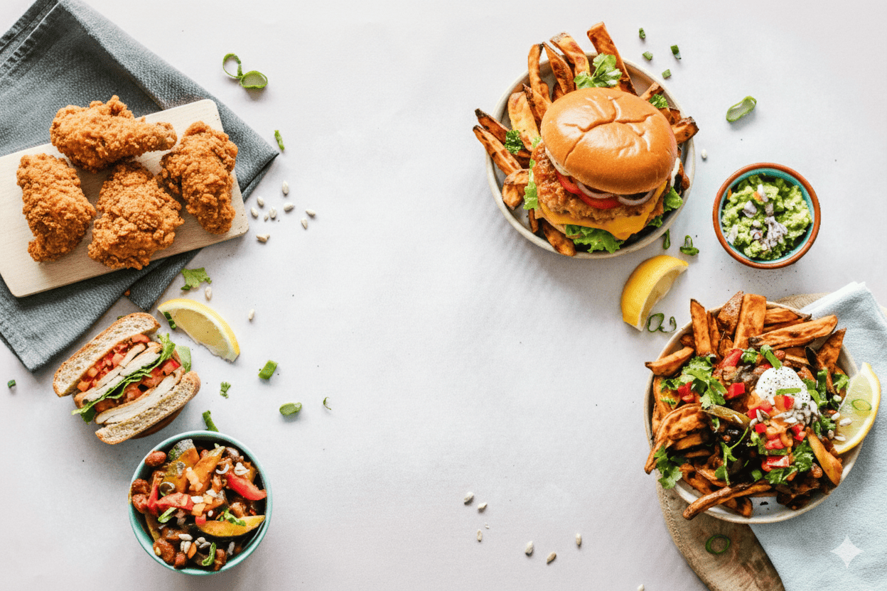

</div>

---

## 📑 Table of Contents

- [🌟 Highlights & Overview](#-highlights--overview)
- [📸 Visual Showcase & Signature Delights](#-visual-showcase--signature-delights)
- [✨ Key Features](#-key-features)
- [🍽️ Comprehensive Menu Categories](#️-comprehensive-menu-categories)
- [🍗 Miami Fried Chicken Specials](#-miami-fried-chicken-specials)
- [🎛️ Admin Management Portal](#️-admin-management-portal)
- [🛠️ Technology Stack](#️-technology-stack)
- [🚀 Quick Start & Installation](#-quick-start--installation)
- [📁 Project Architecture](#-project-architecture)
- [📲 WhatsApp Direct Ordering Flow](#-whatsapp-direct-ordering-flow)
- [🤝 Contributing & Community](#-contributing--community)
- [📄 License & Credits](#-license--credits)

---

## 🌟 Highlights & Overview

**Ooze Cafe** is a fast, responsive, and visually appealing web application built for a modern cafe and dine-in / delivery restaurant. Featuring over **156+ curated menu items across 15 mouth-watering categories**, seamless **one-click WhatsApp ordering**, **smart search & filters**, and an **integrated admin management suite**.

```
  🍽️ 156+ Handcrafted Menu Items      📱 1-Click WhatsApp Ordering
  🍕 15 Diverse Cuisine Categories      ⚡ Sub-Second Vite Performance
  💳 Multi-Currency Support (₹, $, €)    🔒 Protected Admin Dashboard
  📱 100% Mobile & PWA Responsive        🚀 Zero-Friction User Experience
```

---

## 📸 Visual Showcase & Signature Delights

<div align="center">

<table>
  <tr>
    <td align="center" width="50%">
      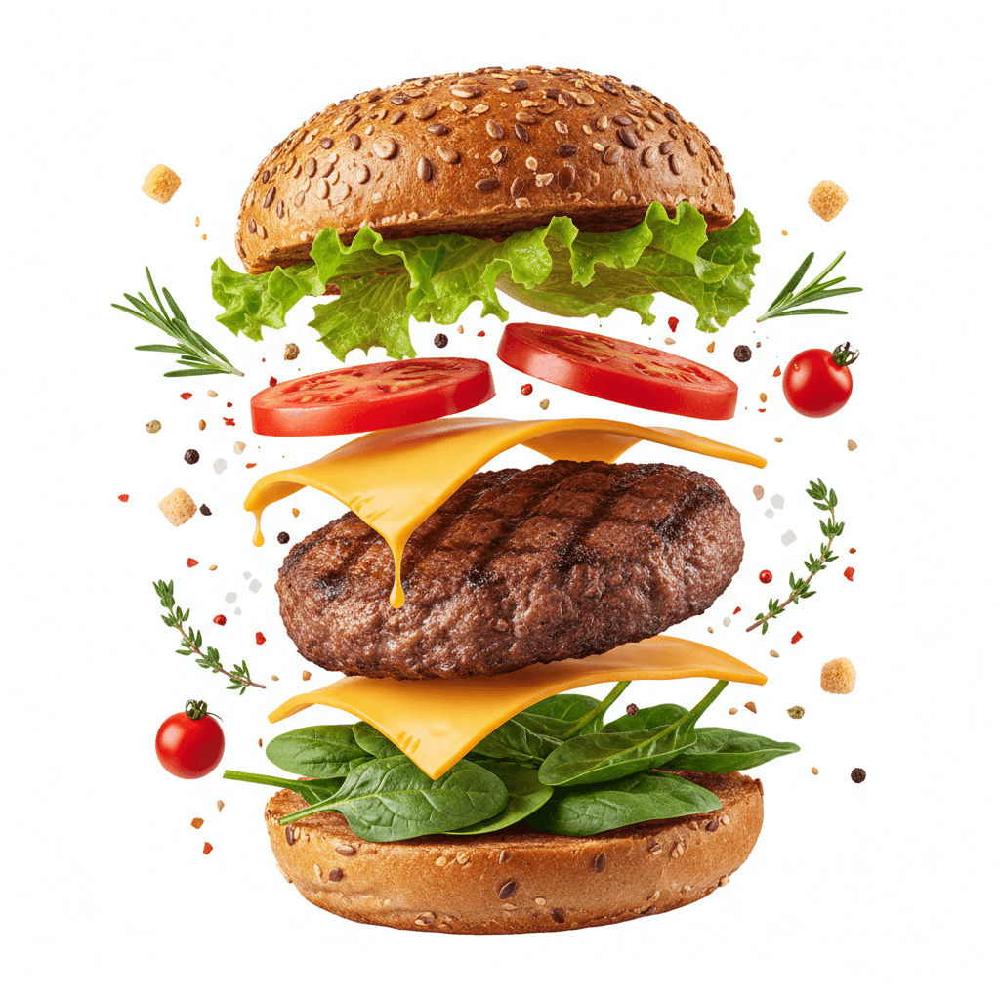<br />
      <b>🍔 Gourmet Burgers</b><br />
      <i>Juicy hand-crafted patties, melted cheddar & brioche buns</i>
    </td>
    <td align="center" width="50%">
      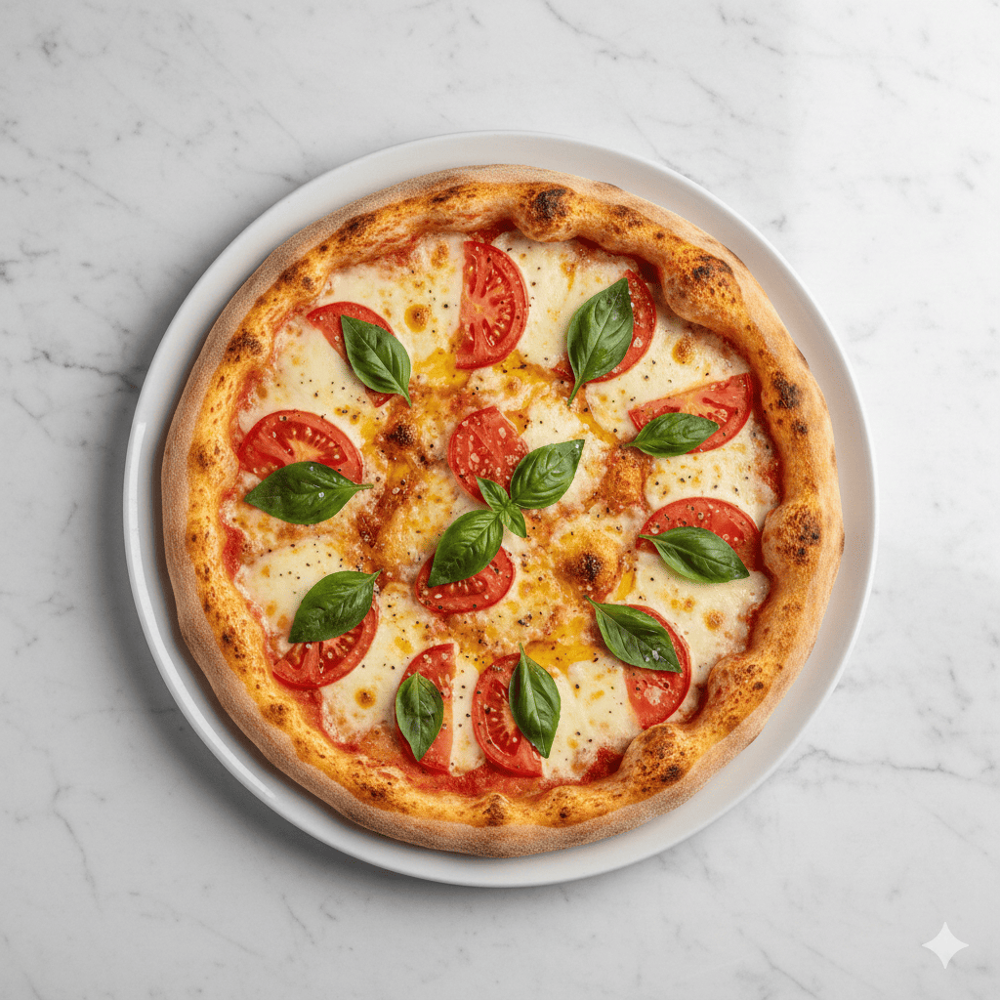<br />
      <b>🍕 Artisan Italian Pizzas</b><br />
      <i>Fresh basil, San Marzano sauce, mozzarella & charred crust</i>
    </td>
  </tr>
  <tr>
    <td align="center" width="50%">
      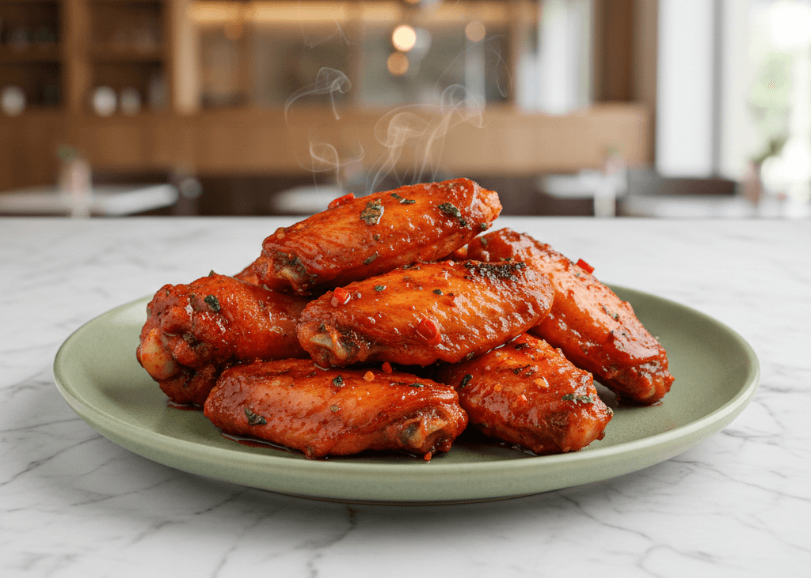<br />
      <b>🍗 Crispy Glazed Wings</b><br />
      <i>Buffalo, BBQ, Peri-Peri & Honey Glazed wings cooked to perfection</i>
    </td>
    <td align="center" width="50%">
      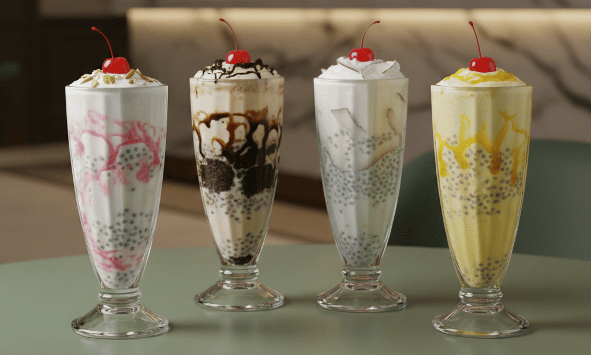<br />
      <b>🍨 Royal Faloodas & Shakes</b><br />
      <i>Rich layers of vermicelli, dry fruits, basil seeds & ice cream</i>
    </td>
  </tr>
  <tr>
    <td align="center" width="50%">
      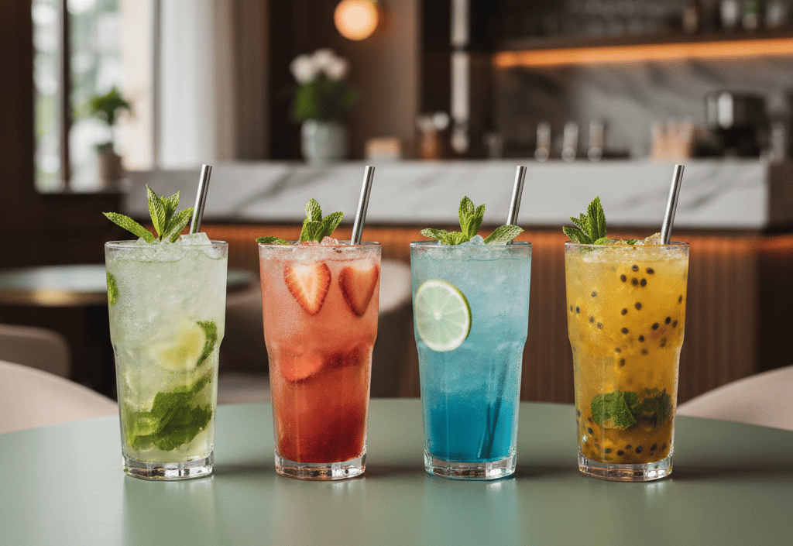<br />
      <b>🍹 Refreshing Mocktails & Mojitos</b><br />
      <i>Mint lime, blueberry crush, green apple & passionfruit fizz</i>
    </td>
    <td align="center" width="50%">
      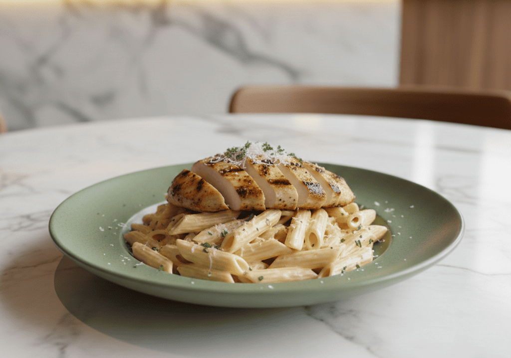<br />
      <b>🍝 Creamy Alfredo & Arrabiata Pastas</b><br />
      <i>Al-dente penne tossed in rich parmesan and garlic herb sauce</i>
    </td>
  </tr>
  <tr>
    <td align="center" width="50%">
      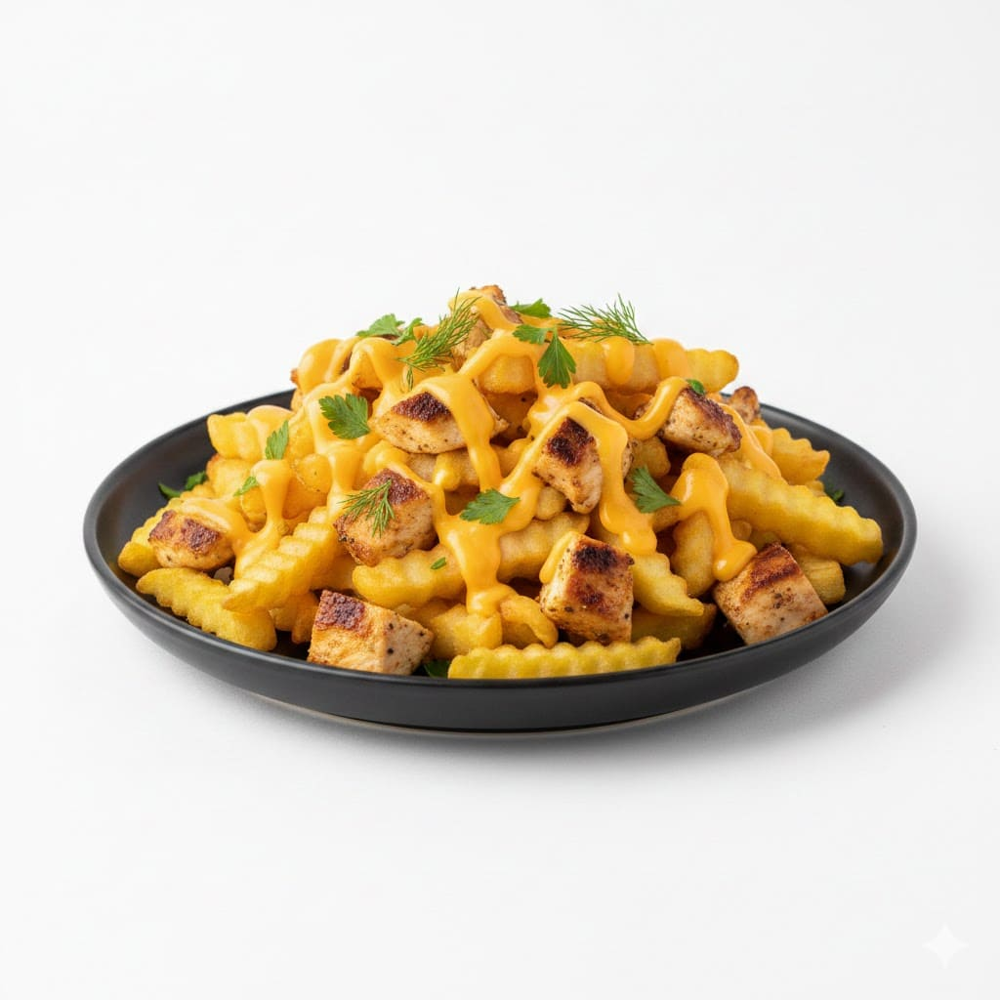<br />
      <b>🍟 Cheesy Loaded Fries</b><br />
      <i>Crispy golden fries smothered in melted cheese, jalapenos & dips</i>
    </td>
    <td align="center" width="50%">
      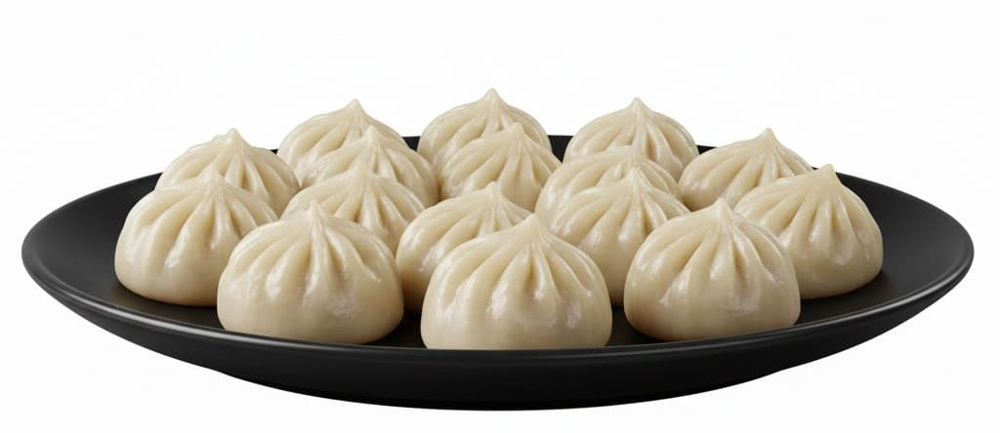<br />
      <b>🥟 Authentic Momos & Dimsums</b><br />
      <i>Steamed or wok-fried dumplings served with fiery chili chutney</i>
    </td>
  </tr>
</table>

</div>

---

## ✨ Key Features

<div align="center">

| Feature | Description | Highlight |
| :--- | :--- | :---: |
| ⚡ **Lightning Fast Experience** | Zero lag navigation powered by Vite 7 and optimized asset pipelines | `React 19` |
| 📱 **Mobile-First & PWA Ready** | Fluid swipe gestures, sticky navigation, and installable web application | `PWA` |
| 🔍 **Live Search & Quick Filters** | Instant dish search by keyword, category, spice level, or vegetarian preference | `Instant` |
| 📲 **1-Click WhatsApp Ordering** | Generates pre-formatted WhatsApp cart messages sent straight to the cafe line | `WhatsApp API` |
| 🎛️ **Full Admin Suite** | Real-time analytics, inventory toggle, pricing edits, and category management | `Admin Panel` |
| 🌐 **Multi-Currency Ready** | Flexible currency switching (₹ INR, $ USD, € EUR, £ GBP) | `Global` |
| 🛡️ **Zero Downtime Routing** | Clean client-side routing with deep-link support on GitHub Pages and static hosts | `SPA` |

</div>

---

## 🍽️ Comprehensive Menu Categories

<div align="center">

| Category | Thumbnail | Total Items | Price Range (₹) | Signature Dish |
| :--- | :---: | :---: | :---: | :--- |
| **🍔 Gourmet Burgers** | 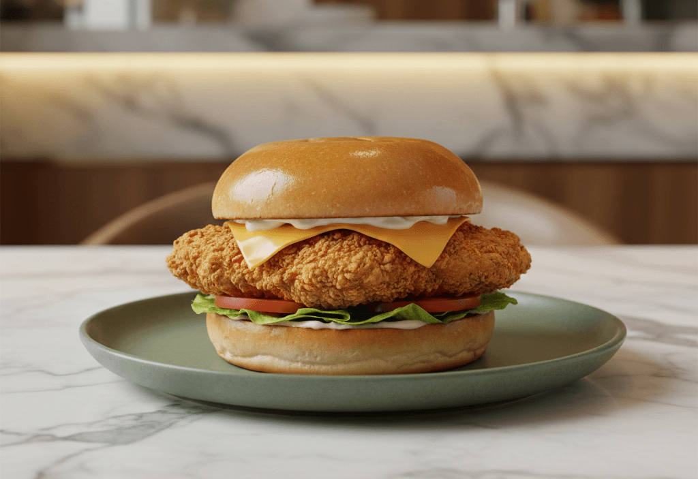 | 15+ | ₹99 – ₹249 | *Double Cheese Smash Burger* |
| **🍕 Artisan Pizzas** | 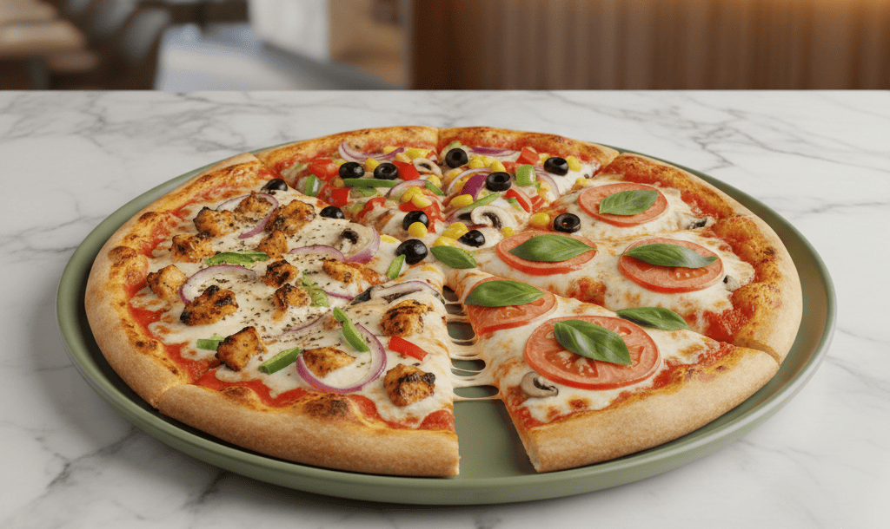 | 10+ | ₹180 – ₹450 | *Italian Margherita & BBQ Chicken* |
| **🍗 Miami Fried Chicken** | 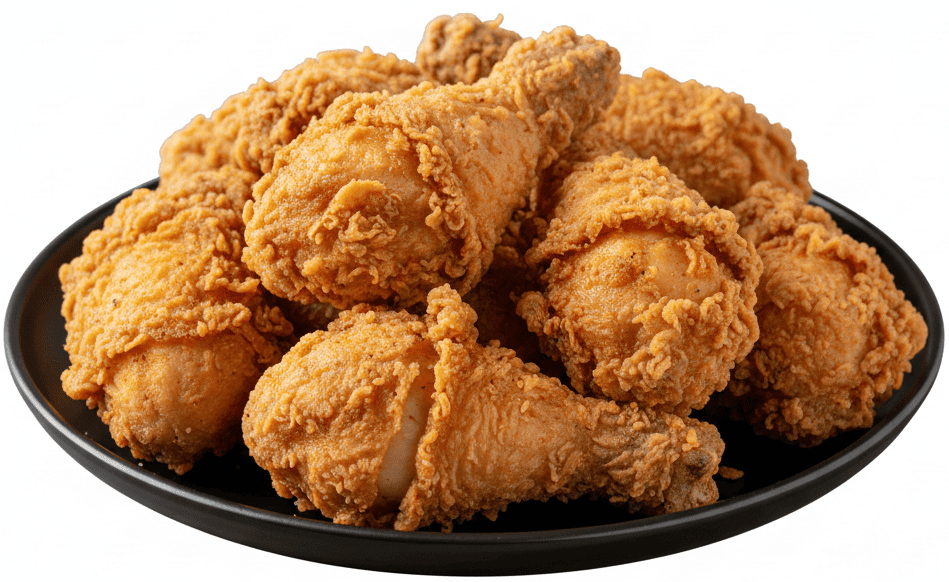 | 12+ | ₹120 – ₹599 | *Miami Crispy Chicken Bucket* |
| **🍗 Wings & Lollipops** |  | 11+ | ₹130 – ₹260 | *Peri-Peri Wings & Chicken Lollipop* |
| **🌯 Wraps & Sandwiches** | 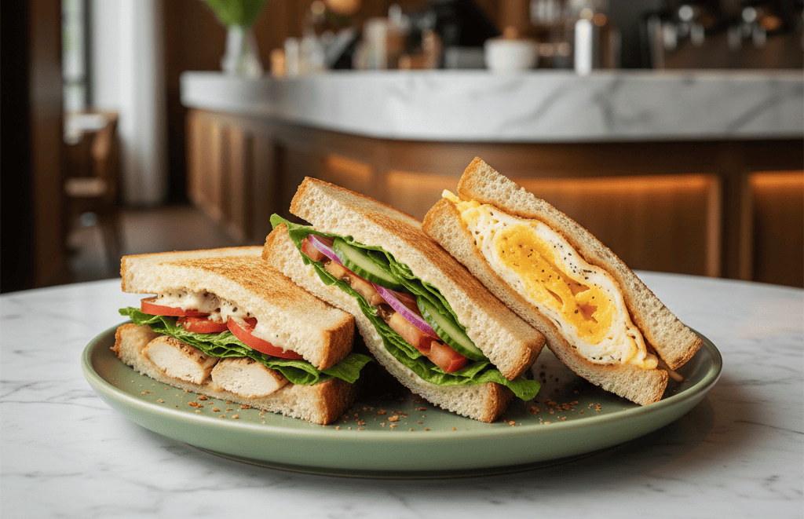 | 14+ | ₹80 – ₹190 | *Chicken Shawarma Roll & Club Sandwich* |
| **🍝 Pastas & Continental** |  | 8+ | ₹140 – ₹280 | *White Sauce Chicken Penne* |
| **🥟 Momos & Dimsums** | 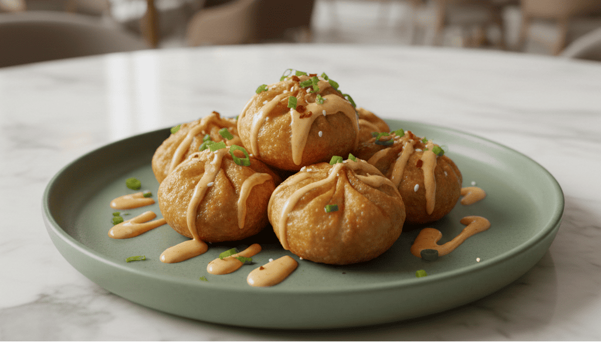 | 8+ | ₹90 – ₹170 | *Steamed Chicken Momos & Fried Cheese Momos* |
| **🍟 Loaded Fries & Snacks** | 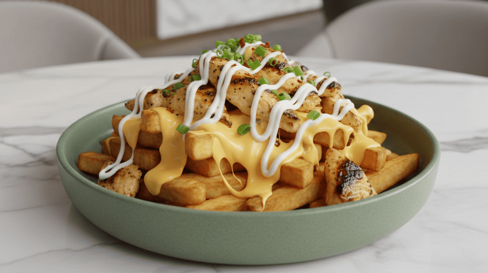 | 9+ | ₹70 – ₹180 | *Dynamite Loaded Chicken Fries* |
| **🥤 Thick Shakes** | 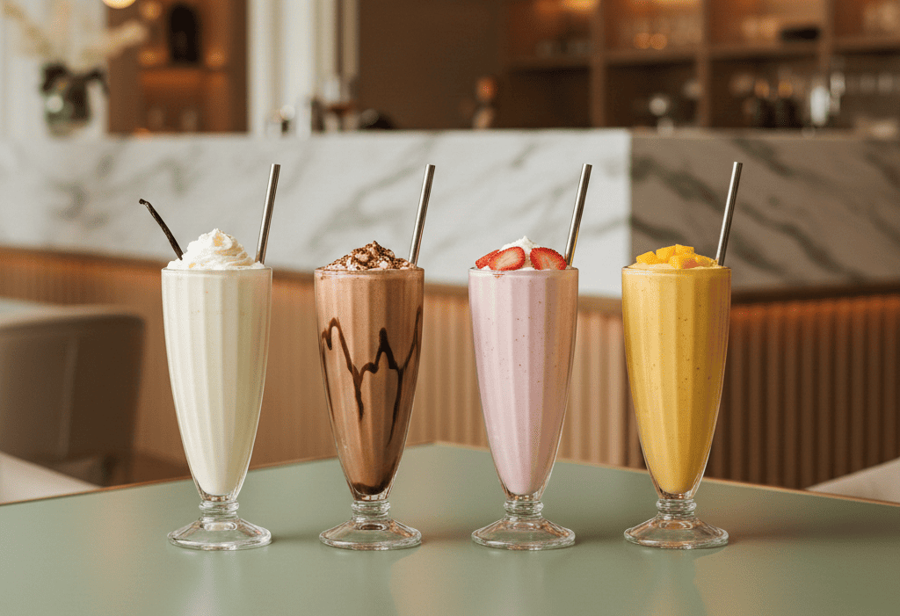 | 20+ | ₹90 – ₹210 | *Oreo Mudslide & Nutella Ferrero* |
| **🍹 Refreshing Mojitos** |  | 15+ | ₹80 – ₹150 | *Blue Curacao & Classic Mint Mojito* |
| **🧃 Fresh Fruit Juices** | 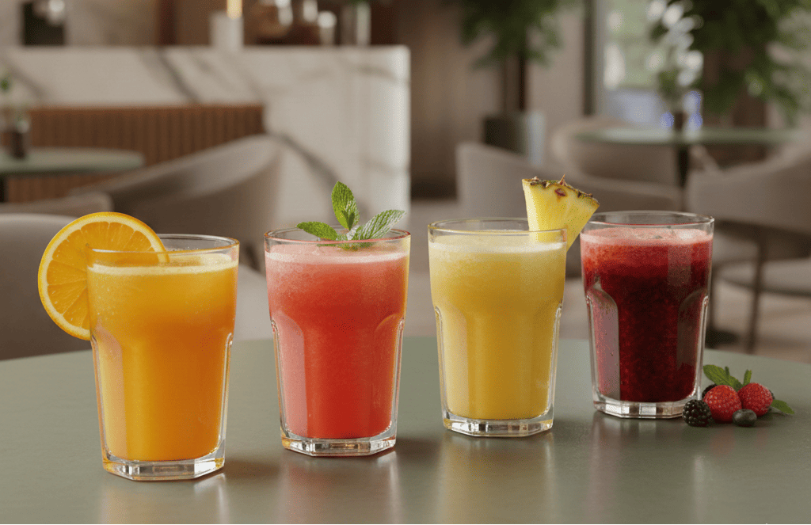 | 12+ | ₹60 – ₹120 | *Pure Orange, Watermelon & Mixed Fruit* |
| **🍨 Royal Faloodas** |  | 8+ | ₹120 – ₹220 | *Ooze Special Dry Fruit Falooda* |
| **🍦 Ice Creams & Sundaes** | 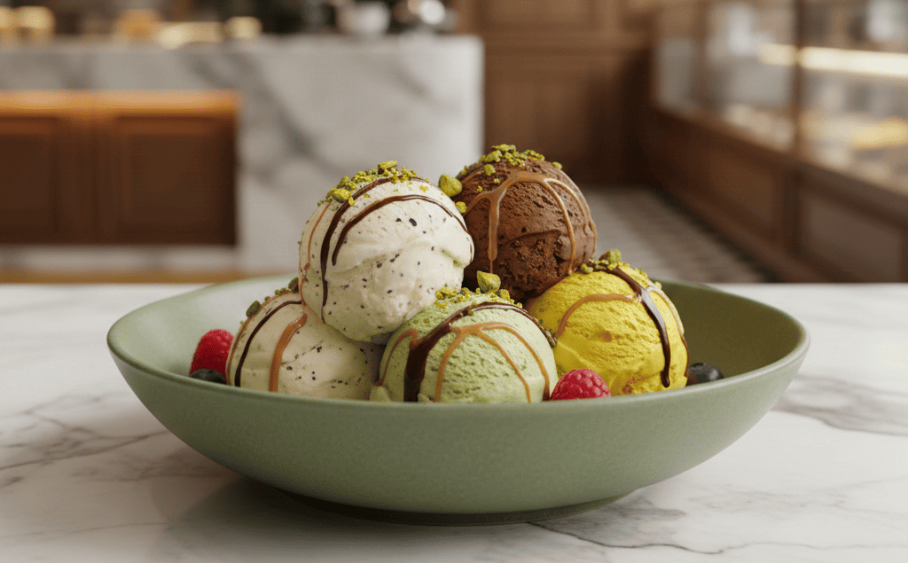 | 10+ | ₹50 – ₹180 | *Triple Chocolate Sundae Bowl* |

</div>

---

## 🍗 Miami Fried Chicken Specials

<div align="center">

  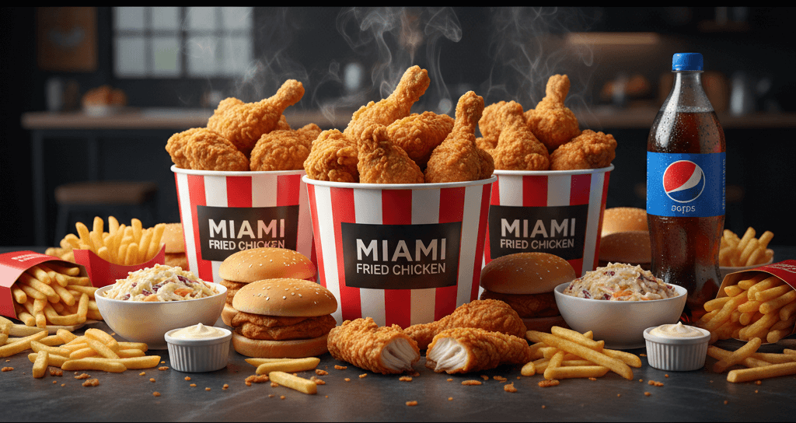

  <table width="90%">
    <tr>
      <td align="center">
        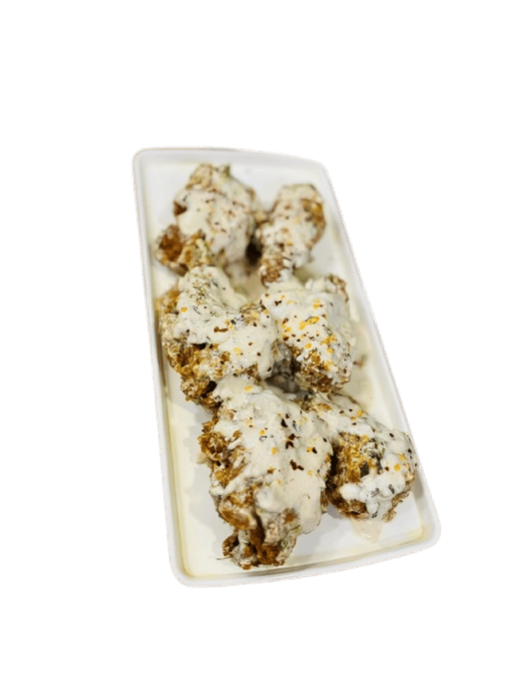<br />
        <b>Afghani Spcl</b><br />
        <i>Mild, creamy cashew & spiced marinade</i>
      </td>
      <td align="center">
        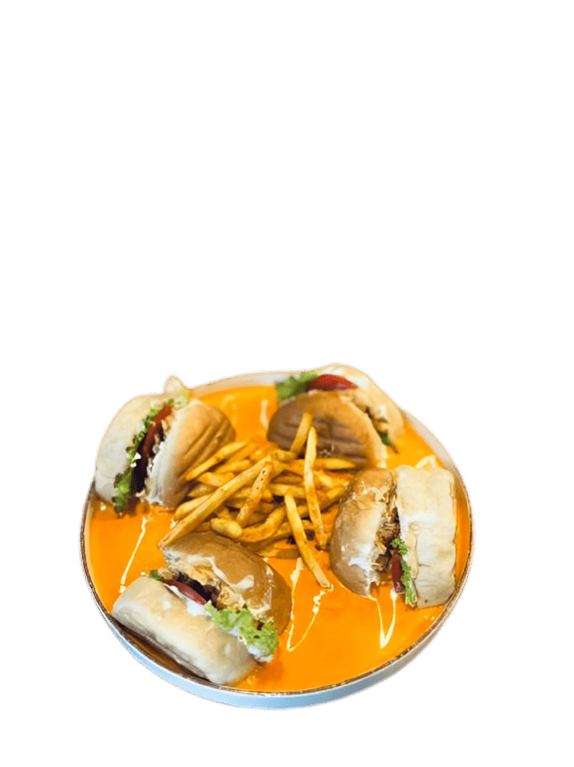<br />
        <b>Hexa Burger</b><br />
        <i>6-layer crispy chicken & cheddar tower</i>
      </td>
      <td align="center">
        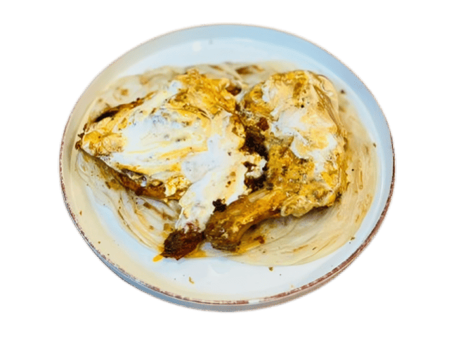<br />
        <b>Iffa Special</b><br />
        <i>House-blend smoky pepper glaze</i>
      </td>
      <td align="center">
        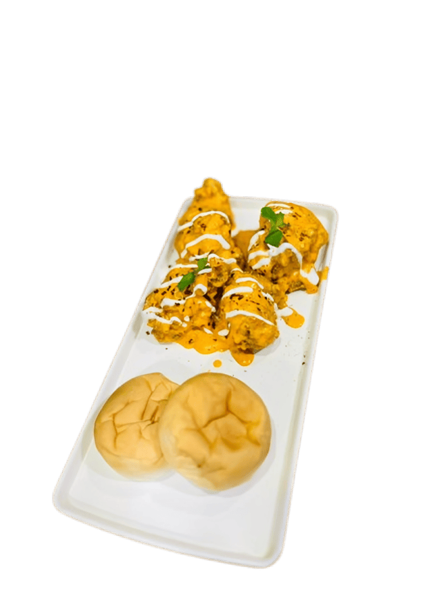<br />
        <b>Turkish Special</b><br />
        <i>Char-grilled Mediterranean herbs</i>
      </td>
    </tr>
  </table>

</div>

---

## 🎛️ Admin Management Portal

The cafe includes a built-in admin dashboard providing business control:

```
┌─────────────────────────────────────────────────────────────┐
│                    OOZE CAFE ADMIN PANEL                    │
├─────────────────┬───────────────────────────┬───────────────┤
│ 📊 Analytics    │ 🍔 Menu Item Manager      │ ⚙️ Settings    │
│ • Live Item Ct  │ • Add / Edit / Remove     │ • WhatsApp No │
│ • Top Dishes    │ • Price Updates (₹, $, €) │ • Business Hr │
│ • Category Stats│ • Availability Toggles    │ • Backups     │
└─────────────────┴───────────────────────────┴───────────────┘
```

- **Demo Route**: `/admin/login` (or access via admin entry point)
- **Demo Credentials**: `admin` / `ooze2024`

---

## 🛠️ Technology Stack

<div align="center">

| Layer | Technologies |
| :--- | :--- |
| **Core UI Framework** |   |
| **Build & Tooling** |   |
| **Styling & Icons** |   |
| **Deployment & Hosting** |   |

</div>

---

## 🚀 Quick Start & Installation

### 1. Clone the Repository
```bash
git clone https://github.com/khadeeja-zakkiya/ooze_cafe.git
cd ooze_cafe/frontend
```

### 2. Install Dependencies
```bash
npm install
```

### 3. Start Local Development Server
```bash
npm run dev
```
> The application will start at `http://localhost:5173` (or `http://localhost:5178`)

### 4. Build for Production
```bash
npm run build
npm run preview
```

### 5. Deploy to GitHub Pages
```bash
npm run deploy
```

---

## 📁 Project Architecture

```
ooze_cafe/
├── frontend/
│   ├── public/
│   │   ├── logo_black.JPG       # Official Brand Logo (Dark)
│   │   ├── logo_white.JPG       # Official Brand Logo (Light)
│   │   ├── logoo.PNG            # Miami Chicken Mascot
│   │   ├── favicon.png          # Browser Favicon
│   │   ├── manifest.json        # PWA Manifest
│   │   └── _redirects           # SPA Routing rules
│   ├── src/
│   │   ├── assets/              # 90+ High-Resolution Food Renders
│   │   │   ├── burger_creative.png
│   │   │   ├── pizza.png
│   │   │   ├── chicken_banner.png
│   │   │   ├── chickenwings.png
│   │   │   ├── faloodas.png
│   │   │   └── ...
│   │   ├── components/          # Reusable UI Elements
│   │   │   ├── Navbar.jsx       # Top Sticky Navigation
│   │   │   ├── Header.jsx       # Hero Carousel & Actions
│   │   │   ├── Footer.jsx       # Footer & Quick Links
│   │   │   └── ScrollToTop.jsx  # Smooth Scroll Manager
│   │   ├── pages/               # Application Views
│   │   │   ├── Menu.jsx         # 156+ Item Interactive Catalog
│   │   │   ├── MiamiFriedChicken.jsx # Signature Chicken Showcase
│   │   │   ├── OurSpecialDish.jsx    # Special Delicacies
│   │   │   ├── DeliverySection.jsx   # Delivery Info & Timings
│   │   │   ├── AboutUs.jsx      # Story & Cafe Philosophy
│   │   │   ├── ContactUs.jsx    # Location, Map & Timings
│   │   │   └── ...
│   │   ├── App.jsx              # Main Route Definitions
│   │   ├── main.jsx             # React DOM Entry
│   │   └── index.css            # Global Theme Tokens & Styles
│   ├── package.json
│   └── vite.config.js
└── README.md
```

---

## 📲 WhatsApp Direct Ordering Flow

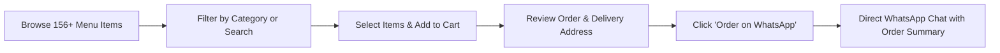
```mermaid
graph LR
    A[Browse 156+ Menu Items] --> B[Filter by Category or Search]
    B --> C[Select Items & Add to Cart]
    C --> D[Review Order & Delivery Address]
    D --> E[Click 'Order on WhatsApp']
    E --> F[Direct WhatsApp Chat with Order Summary]
```

---

## 🤝 Contributing & Community

Contributions make the open-source community an incredible place to learn, inspire, and create. Any contributions you make are **greatly appreciated**!

1. Fork the Project
2. Create your Feature Branch (`git checkout -b feature/AmazingFeature`)
3. Commit your Changes (`git commit -m 'Add some AmazingFeature'`)
4. Push to the Branch (`git push origin feature/AmazingFeature`)
5. Open a Pull Request

---

## 👥 Team & Maintainers

<div align="center">

**Project Maintainer**: [Khadeeja Zakkiya](https://github.com/khadeeja-zakkiya)

Made with ❤️, 🍕, and lots of ☕ for the **Ooze Cafe** experience.

<br />

<p align="center">
  <a href="#-ooze-cafe--the-next-level-cafe-">⬆ Back to Top</a>
</p>

</div>
